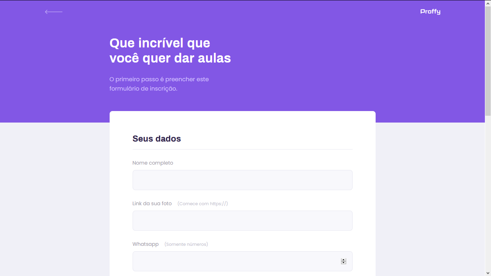
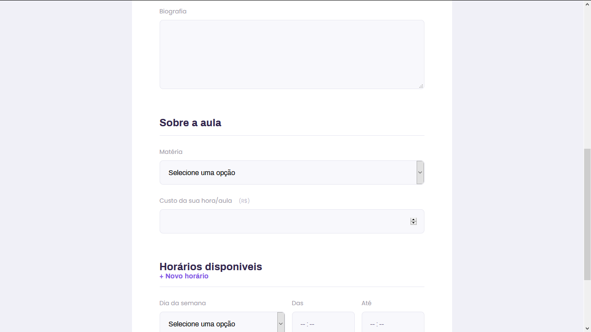
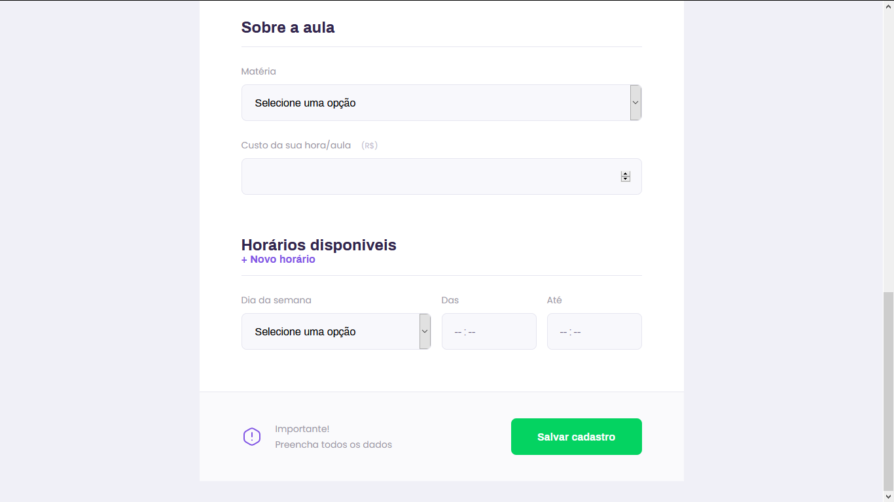
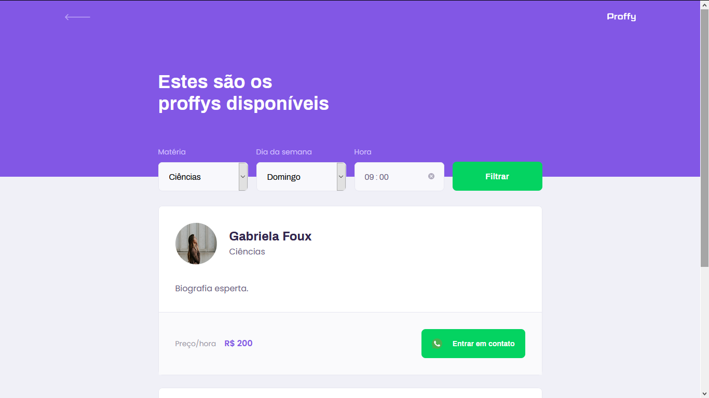
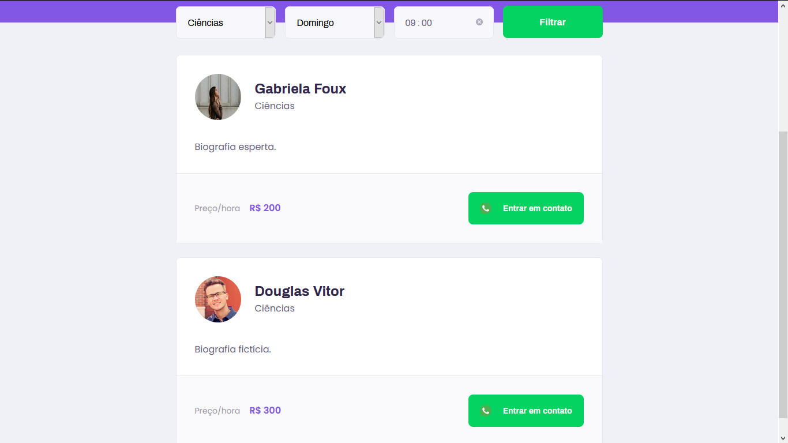
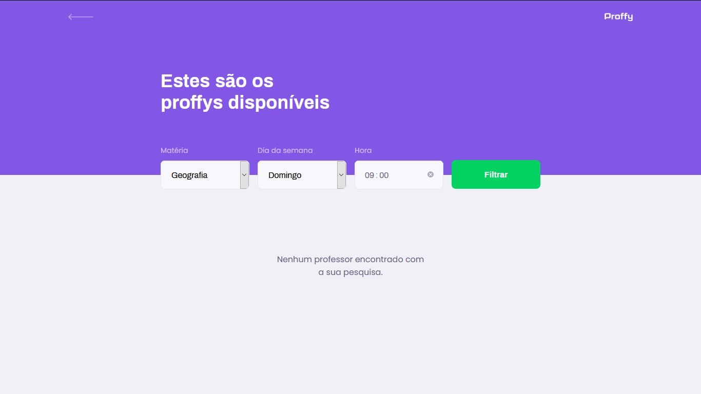

# Proffy

###### Projeto sugerido no evento NLW2, que é a criação de um sistema onde alunos podem encontrar professores online para receber aulas; E professores podem se cadastrar no sistema para oferecer seus srviços e ministrar aulas. Aplicação trabalha as duas partes do mercado, que seriam a oferta e demanda.

###### **Evento :** Next Level Week 2ª Edição - [Rocketseat](https://rocketseat.com.br)
###### **Instrutor :** Mayk Brito

## Instruções : 
Para iniciar o srvidor da aplicação use o comando _npm run dev_ então acesse pelo navegador _http://127.0.0.1:5500/_ 

## **Tecnologias utilizadas**
- HTML - Front-End;
- CSS - Front-End;
- Nunjucks(Template Engine) - Front-End
- JAVASCRIPT - Back-End;
- SQLITE - Persistência dos dados.

## **Prints**

